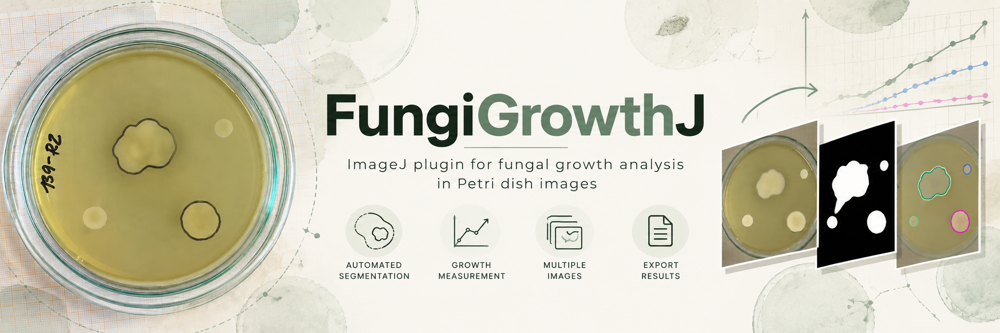

<p align="center">
  
</p>


# FungiGrowthJ

<p align="center">
  <strong>Reproducible image analysis of fungal colony growth in Fiji/ImageJ</strong>
</p>

<p align="center">
  From photographed Petri dishes to traceable, calibrated colony-level measurements.
</p>

<p align="center">
  
  
  
  
</p>

---

## Overview

**FungiGrowthJ** is an open scientific workflow for the reproducible analysis of longitudinal fungal colony growth from digital photographs of Petri dishes.

The software combines automated image processing with explicit human review. It detects the usable agar region, generates a binary detection mask, proposes colony objects, calculates geometric and spatial measurements, and exports traceable results for downstream biological analysis.

The workflow is designed for experiments in which the same biological replicate is photographed repeatedly through time.

> **Core principle:** automate repetitive image processing without hiding scientific decisions.

FungiGrowthJ does not treat image processing and biological interpretation as the same task. The plugin produces image-level measurements and documented review decisions; the separate **Biological Analysis Notebook** performs temporal aggregation, statistical analysis, visualization, and multivariate analysis.

---

## What FungiGrowthJ does

### Image analysis

- Spatial calibration from known distances.
- Representative agar sampling.
- Interactive agar ROI detection.
- Binary detection-mask generation.
- Conservative gap closure and preprocessing.
- Optional manual cleaning of dark artifacts.
- Detection of candidate colony objects.
- Enhanced partitioning of touching/connected colonies.
- Detection of very small or point-like candidates for explicit review.

### Human review

FungiGrowthJ keeps the final biological decision under user control.

Each detected object can be:

- accepted as proposed;
- confirmed as **central** (`CEN`);
- confirmed as **satellite** (`SAT`);
- ignored (`IGN`);
- deferred (`DEF`);
- manually edited;
- replaced with a manually drawn ROI;
- corrected with **Cut / Trim**;
- split into multiple colony ROIs.

Manual interventions are preserved through review and edit-trace fields, including parent/child relationships for split and cut operations.

### Quantitative outputs

For each retained colony ROI, FungiGrowthJ can export:

- area and perimeter;
- equivalent radius and diameter;
- major/minor axes and radii;
- Feret measurements;
- centroid coordinates;
- distance to plate center;
- distance to the central colony;
- distance to the inoculation origin, when recorded;
- circularity;
- aspect ratio;
- eccentricity;
- solidity;
- convexity;
- ellipse and Feret angles;
- plate occupancy.

The exported table also contains classification, review, revision, and traceability metadata.

---

## The workflow

```text
Photograph
    │
    ▼
Spatial calibration
    │
    ▼
Representative agar sample
    │
    ▼
Agar ROI detection and confirmation
    │
    ▼
Detection mask + preprocessing
    │
    ├── optional artifact cleaning
    └── optional touching-colony partition
    │
    ▼
Candidate colony detection
    │
    ▼
Human review and classification
    │
    ├── accept / central / satellite / ignore / defer
    ├── manual ROI replacement
    ├── Cut / Trim
    └── Split ROI
    │
    ▼
Image-level CSV + traceability
    │
    ▼
Biological Analysis Notebook
    │
    ├── longitudinal aggregation
    ├── replicate-level growth summaries
    ├── central / satellite / global composition
    ├── morphology
    ├── statistical comparisons
    ├── PCA
    └── hierarchical clustering
```

---

## A deliberate separation between measurement and analysis

FungiGrowthJ is the **measurement layer**.

It answers questions such as:

> Where is the colony?  
> How large is it?  
> How circular or elongated is it?  
> How far is it from the plate center or inoculation origin?  
> Was the ROI automatically detected, edited, cut, or split?  
> Was the object classified as `CEN`, `SAT`, or `IGN`?

The Biological Analysis Notebook is the **analysis layer**.

It answers questions such as:

> How does colony size change through time?  
> What is the observed growth rate of each replicate?  
> How much of the total phenotype is contributed by satellites?  
> How do strains differ in morphology?  
> How similar are strains in multivariate phenotype space?

This separation keeps image processing, biological aggregation, and statistical interpretation independently reproducible.

---

## Scientific data model

FungiGrowthJ exports an **object-level** table.

A single photograph can therefore produce several rows:

```text
image
 ├── CEN
 ├── SAT
 ├── SAT
 └── IGN
```

The biological classification used for downstream filtering is:

| `final_type` | Meaning | Biological use |
|---|---|---|
| `CEN` | Confirmed central colony | Retain |
| `SAT` | Confirmed satellite colony | Retain |
| `IGN` | Ignored object | Exclude from biological summaries |
| `DEF` | Deferred review | Do not treat as confirmed |
| `UNR` | Unreviewed | Do not treat as confirmed |
| `UNK` | Unknown/unrecognized | Inspect before use |

### Important filtering rule

Use **`final_type`** to define biological inclusion.

Do **not** use `review_code` as the main biological filter. `review_code` records what happened during review or editing. For example, a valid central colony may have:

```text
final_type = CEN
review_code = MAN_CONF
```

or:

```text
final_type = CEN
review_code = ROI_CUT
```

The edit/review history does not by itself determine whether a biological object should be retained.

---

## Traceability by design

FungiGrowthJ is designed so that manual intervention does not disappear into an opaque final measurement.

Relevant provenance fields include:

```text
analysis_revision
parent_object_id
edit_operation
roi_source
final_type
review_status
review_flag
review_code
review_note
edited_manually
software_version
```

This makes it possible to distinguish:

- an automatically detected colony;
- a manually confirmed classification;
- an edited ROI;
- a manually replaced ROI;
- a colony produced by splitting a merged object;
- a fragment discarded after Cut / Trim;
- an object retained but flagged for review.

The original photograph is never modified by these operations.

---

## Longitudinal analysis

FungiGrowthJ is designed for repeated observations of the same biological replicate.

The recommended experiment organization is:

```text
Experiment/
└── Strain/
    └── Replicate/
        └── YYYYMMDD/
            └── image.jpg
```

The Batch workflow preserves experiment-level state and supports interruption, restart, review, and recovery.

Typical states include:

```text
PENDING
IN_PROGRESS
COMPLETED
ERROR
REVIEW
INTERRUPTED
SKIPPED
TRAVERSED
```

A missing photograph is an unavailable observation; it must not be interpreted automatically as zero growth.

---

## Biological Analysis Notebook

The repository also contains the **FungiGrowthJ Biological Analysis Notebook**.

It takes an archive of FungiGrowthJ result CSV files and performs the downstream biological analysis.

The notebook:

1. loads the result CSV files from a ZIP archive;
2. normalizes metadata;
3. resolves repeated revisions of the same image;
4. identifies the central colony from the explicit FungiGrowthJ classification;
5. builds date-level and replicate-level summaries;
6. calculates observed growth rates and endpoints;
7. summarizes central, satellite, and global colony composition;
8. analyzes morphology;
9. performs omnibus and exploratory pairwise comparisons;
10. generates PCA and hierarchical clustering;
11. exports tables, figures, and a standalone HTML report.

The notebook does **not** infer the central colony from size or position. The biological classification comes from the FungiGrowthJ output.

Growth rates are descriptive linear slopes over the observed interval; the notebook does not fit exponential, logistic, Gompertz, Richards, or other mechanistic growth models.

Satellite count is interpreted as a measure of **identifiable/separable satellite colonies**, not necessarily as a direct count of biological propagules.

---

## Repository structure

```text
FungiGrowthJ/
│
├── plugin/
│   ├── FungiGrowthJ.js
│   └── modules/
│       ├── FGJ_Batch.js
│       ├── FGJ_Common.js
│       ├── FGJ_ExperimentManager.js
│       ├── FGJ_SingleImage.js
│       └── FGJ_UI.js
│
├── docs/
│   ├── FungiGrowthJ_User_Manual_EN.html
│   └── FungiGrowthJ_User_Manual_ES.html
│
├── notebook/
│   ├── FungiGrowthJ_Biological_Report.ipynb
│   └── FungiGrowthJ_Biological_Analysis_Notebook_User_Manual_EN.html
│
└── README.md
```

The public documentation is primarily written in English. A Spanish version of the main FungiGrowthJ user manual is also provided.

---

## Getting started

### 1. Install Fiji/ImageJ

FungiGrowthJ is designed to run within Fiji/ImageJ.

### 2. Install the plugin

Place the FungiGrowthJ launcher and module files in the Fiji plugins structure described in the user manual.

The user entry point is:

```text
FungiGrowthJ.js
```

### 3. Organize the experiment

Use a stable hierarchy of:

```text
strain → replicate → date → image
```

with dates written as:

```text
YYYYMMDD
```

### 4. Analyze images

Use **Single Image** for individual analysis or testing, and **Batch** for longitudinal experiments.

### 5. Review before biological analysis

Automatic proposals are not equivalent to final biological classification. Review important objects, especially low-circularity, very small, touching, or manually corrected ROIs.

### 6. Analyze the exported results

Use the Biological Analysis Notebook for temporal aggregation, replicate-level summaries, statistics, figures, PCA, clustering, and report generation.

---

## Documentation

### FungiGrowthJ User Manual

**English**

[`docs/FungiGrowthJ_User_Manual_EN.html`](docs/FungiGrowthJ_User_Manual_EN.html)

**Español**

[`docs/FungiGrowthJ_User_Manual_ES.html`](docs/FungiGrowthJ_User_Manual_ES.html)

The manual covers installation, image acquisition, calibration, agar ROI detection, detection settings, artifact cleaning, touching-colony partition, colony detection, ROI review, manual correction, Cut / Trim, Split ROI, Batch/restart, exported variables, filtering rules, troubleshooting, and reproducibility.

### Biological Analysis Notebook

[`notebook/FungiGrowthJ_Biological_Analysis_Notebook_User_Manual_EN.html`](notebook/FungiGrowthJ_Biological_Analysis_Notebook_User_Manual_EN.html)

[`notebook/FungiGrowthJ_Biological_Report.ipynb`](notebook/FungiGrowthJ_Biological_Report.ipynb)

---

## Current release

### FungiGrowthJ Single Image — `0.3.74`

The current practical release includes:

- calibrated measurements;
- interactive agar ROI selection;
- binary detection-mask preprocessing;
- optional manual dark-artifact cleaning;
- enhanced touching-colony partition;
- low-confidence very-small candidate detection;
- ROI review and classification;
- manual ROI replacement;
- Cut / Trim;
- Split ROI;
- persistent review and traceability information.

### FungiGrowthJ Batch — `0.2.25`

The current Batch workflow adds:

- structured experiment processing;
- persistent project state;
- restart/recovery;
- image-level result persistence;
- workflow status tracking;
- review of unresolved observations.

---

## Reproducibility

A reproducible analysis should retain together:

- the original photographs;
- the exact FungiGrowthJ version;
- the exact result CSV files;
- calibration information;
- relevant detection settings;
- manual correction history;
- parent/child traceability;
- Batch state and logs;
- the exact Biological Analysis Notebook version;
- generated tables and figures;
- the standalone HTML report.

This makes it possible to distinguish biological changes from changes introduced by image analysis or downstream processing.

---

## Why the workflow keeps the original image untouched

Manual interventions operate on ROIs and detection masks rather than modifying the source photograph.

For example:

```text
Original photograph
        │
        ├── remains unchanged
        │
        ▼
Detection mask
        │
        ├── optional artifact cleaning
        │
        ▼
Candidate ROI
        │
        ├── review
        ├── edit
        ├── cut
        └── split
        │
        ▼
Final measured ROI
```

The resulting measurement can therefore be re-evaluated against the original image.

---

## Design principles

FungiGrowthJ is built around six principles:

**Transparency** — automated decisions remain inspectable.

**Human validation** — users can confirm, correct, or exclude candidate objects.

**Originals intact** — source images are never overwritten.

**Traceability** — edits, classifications, revisions, and parent/child relationships are retained.

**Separation of concerns** — measurement and biological analysis are separate workflows.

**Reproducibility** — the software records the information needed to reconstruct how an observation was produced.

---

## Project status

FungiGrowthJ is an actively developed scientific software project.

The repository currently contains the practical Single Image and Batch workflows, the biological analysis notebook, and bilingual user documentation. The current release should be considered the reference implementation for the documented workflow.

---

## License

FungiGrowthJ is released under the MIT License.

See the [LICENSE](LICENSE) file for the full license text

---

<p align="center">
  <em>FungiGrowthJ — making fungal growth measurements traceable, reviewable, and reproducible.</em>
</p>
